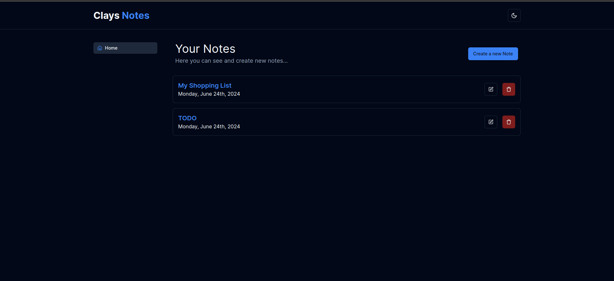

# Notes Application Frontend



## Overview

This application is a simple and elegant notes manager built using Next.js. It allows users to perform CRUD (Create, Read, Update, Delete) operations on notes. Each note consists of a title, description, and the date it was created. The app leverages Server-Side Rendering (SSR) for optimal performance and uses Tailwind CSS for styling.

## Features

- **Create Notes**: Easily create new notes with a title and description.
- **Read Notes**: View all your notes with their titles, descriptions, and creation dates.
- **Update Notes**: Edit the content of existing notes.
- **Delete Notes**: Remove notes that are no longer needed.
- **Server-Side Rendering (SSR)**: Ensures fast load times and improves SEO.
- **Tailwind CSS**: Utilized for modern, responsive, and customizable UI design.
- **Precommit Hooks**: Ensures code quality with linting and formatting checks before commits.
- **Commitizen**: Facilitates standardized and meaningful commit messages.

## Tech Stack

- **Next.js**: React framework for SSR and static site generation.
- **Tailwind CSS**: Utility-first CSS framework for rapid UI development.
- **Axios**: Promise-based HTTP client for making API requests.
- **Moment.js**: Library for parsing, validating, manipulating, and formatting dates.
- **Zod**: TypeScript-first schema declaration and validation library.

## Getting Started

### Prerequisites

- Node.js (>= 12.x)
- npm or yarn

### Installation

1. Clone the repository:

   ```bash
   git clone https://github.com/yourusername/notes-app.git
   cd notes-app
   ```

### Running the App

1. Create network(if not exists before):
   ```bash
    docker create network app-network
   ```
2. Run docker container:

   ```bash
    docker-compose up
   ```

   The app will be available at [http://localhost:3000](http://localhost:3000).

### Linting and Formatting

To check linting errors and format code:

```bash
yarn lint
yarn format
```

### Using Commitizen

Commitizen helps you to write standardized commit messages. To use it:

```bash
npm run commit
# or
yarn commit
```

Follow the prompts to write a conventional commit message.
